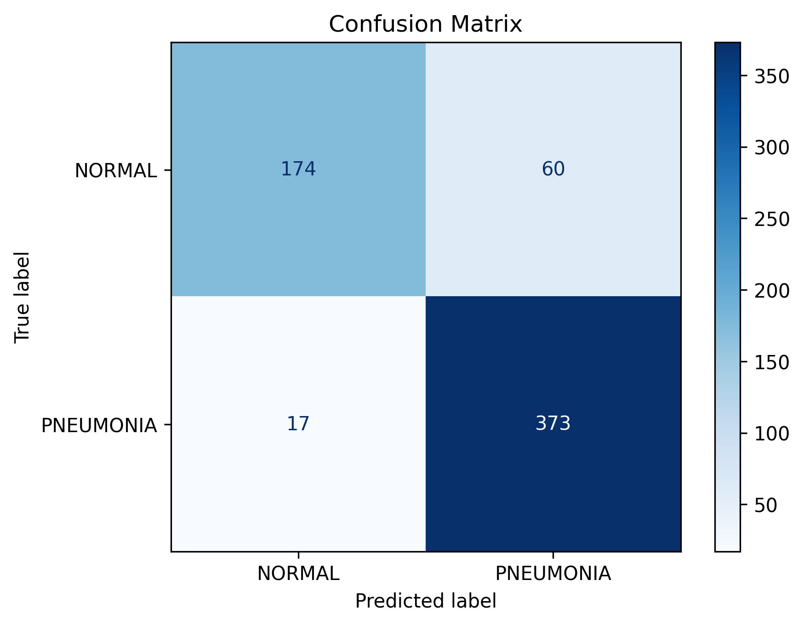

# PneumoVision

An AI-powered pneumonia detection system built using TensorFlow and Convolutional Neural Networks (CNNs). This project classifies chest X-ray images as either **Normal** or **Pneumonia**.

---

## Project Overview

PneumoVision is a deep learning project developed to explore how artificial intelligence can assist in medical image analysis.

The model was trained on chest X-ray images using TensorFlow/Keras and evaluated on an independent test dataset.

---

## Dataset

Dataset:
Chest X-Ray Images (Pneumonia)

Classes:
- Normal
- Pneumonia

Images are resized to:

224 × 224 pixels

---

## Technologies

- Python
- TensorFlow / Keras
- NumPy
- Matplotlib
- Scikit-Learn
- Jupyter Notebook

---

## Project Structure

```
PneumoVision/

├── data/
├── models/
├── notebooks/
├── results/
│   ├── figures/
│   └── metrics/
├── src/
├── README.md
```

---

## Model Performance

Test Accuracy:

## Model Performance

### Test Accuracy

**87.66%**

### Confusion Matrix

The model was evaluated on 624 test X-ray images.

| | Predicted Normal | Predicted Pneumonia |
|---|---:|---:|
| **Actual Normal** | 174 | 60 |
| **Actual Pneumonia** | 17 | 373 |

The model correctly classified **547 of 624 images**, resulting in an overall accuracy of **87.66%**.

### Key Observations

- Correctly classified **174 of 234 Normal cases**
- Correctly classified **373 of 390 Pneumonia cases**
- **60 Normal images** were incorrectly classified as Pneumonia
- **17 Pneumonia images** were incorrectly classified as Normal
- The model shows substantially improved performance compared with the initial CNN evaluation.
- Improving Normal-class recall remains an important area for further development.

---

## Confusion Matrix



---

## Classification Report

```text
precision    recall    f1-score    support

NORMAL        1.00      0.07      0.13       234
PNEUMONIA     0.64      1.00      0.78       390

accuracy                          0.65       624
macro avg     0.82      0.53      0.45       624
weighted avg  0.78      0.65      0.54       624
```

---

## Future Improvements

- Improve Normal-class recall
- Experiment with transfer learning (EfficientNet, ResNet)
- Perform hyperparameter tuning
- Deploy as a web application
- Add Grad-CAM explainability visualizations

---

## Author

Developed by Milo Marvel

Bioengineering Student

Oregon State University